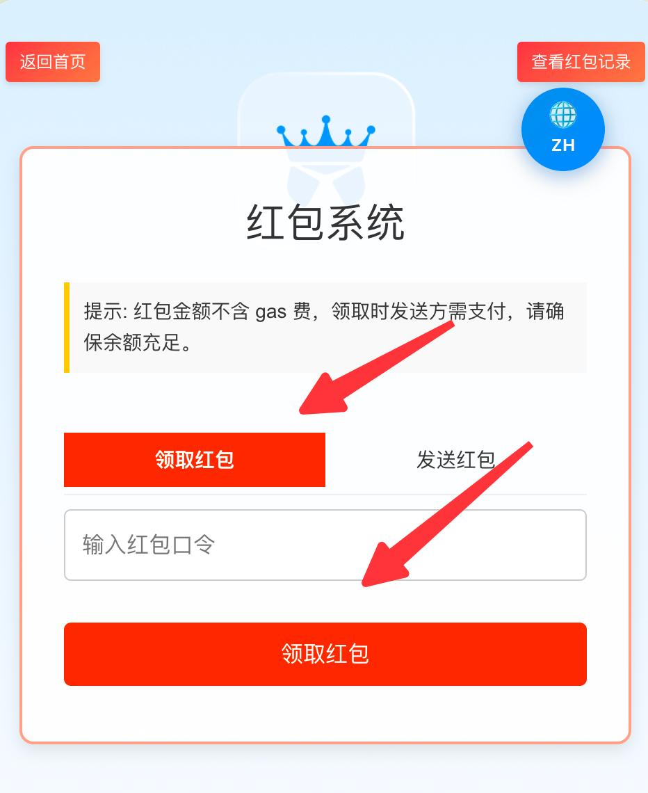
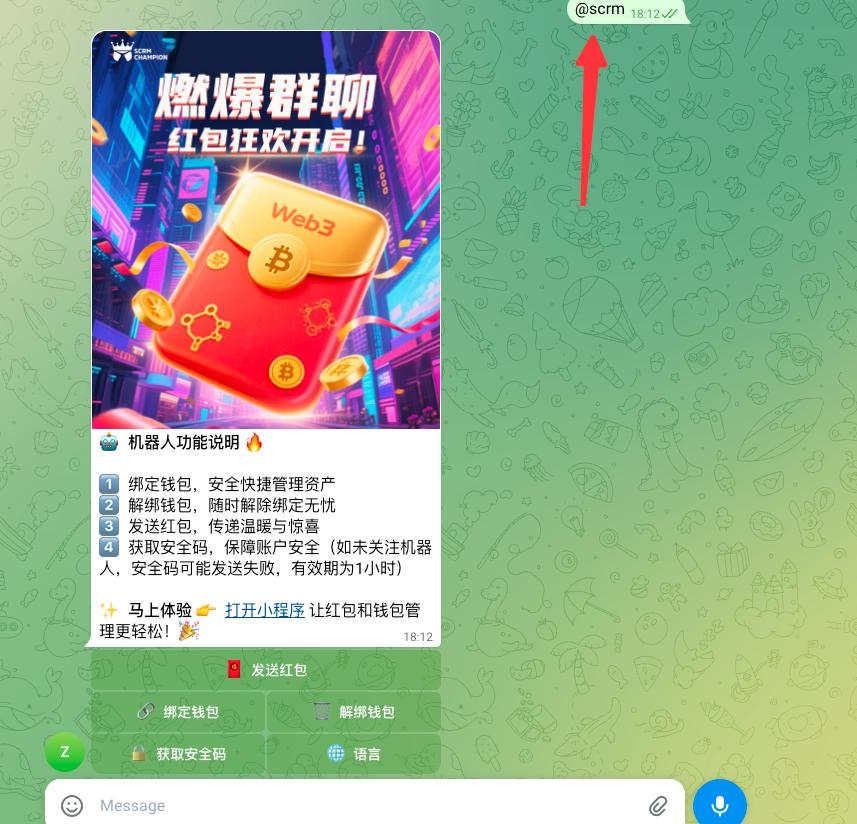

# Web3管理

功能简介

✅Web3红包系统旨在为用户提供在Telegram社群中发送、领取和绑定红包的便捷功能。通过区块链技术为您的社群带来全新的互动体验。

## 操作流程

### 一、唤醒机器人

1.1 群内唤醒机器人

说明：从 scrmchampion 后台将机器人拉入自己的群后在群内输入@scrm 关键词唤醒机器
\
人（注意前后不要有空格）。

<figure><figcaption></figcaption></figure>

唤醒机器人后会弹出菜单

<figure><figcaption></figcaption></figure>

1.2 群内操作机器人

1.2.1 打开小程序

1.2.1.1 点击打开小程序

<figure><figcaption></figcaption></figure>

1.2.1.2 关注机器人

点击 START 关注机器人，后续私聊消息会通过该机器人发送、如果后续机器人变更需
\
要重新关注新机器人否则私聊消息将无法推送给您。

<figure><figcaption></figcaption></figure>

后续打开小程序可直接登录点击 左边的快捷菜单【SCRM ChampionApp】快速进入
\
小程序。

<figure><figcaption></figcaption></figure>

1.2.1.3 进入小程序

1、点击下方两个入口按钮都可以进入小程序

<figure><figcaption></figcaption></figure>

2、进入小程序后您可以自由切换小程序语种

<figure><figcaption></figcaption></figure>

3、绑定您的以太坊钱包

<figure><figcaption></figcaption></figure> <figure><figcaption></figcaption></figure>

安装 MetaMask 【https://metamask.io/download】；以下是使用谷歌浏览器从 metamask
\
（小狐狸）钱包扩展；复制你的以太坊钱包地址填入。

<figure><figcaption></figcaption></figure>

填入安全码：安全码一共 8 个字符需要包含英文大小和数字；后续会在发送红包中作
\
为安全校验密码使用。

填入邮箱：填写您的邮箱；后续会在发送红包中为您发送邮件验证码。最后点击绑定钱
\
包按钮完成钱包绑定。

<figure><figcaption></figcaption></figure>

### 二、小程序内发送或领取红包

2.1 发送红包

<figure><figcaption></figcaption></figure> <figure><figcaption></figcaption></figure>

1、选择红包类型：
\
普通红包：会按您填写的金额数和红包个数进行平均分配。
\
拼手气红包：会按您填写的金额数和红包个数随机为每一个红包分配金额。

2、填写金额（ETH）：
\
红包金额最小支持小数点后 18 位。

3、填写红包数量。

4、点击发送红包按钮。

5、输入您的安全码。

<figure><figcaption></figcaption></figure>

6、点击确认发送按钮。


注意：如果您不是 SCRM 用户请前往: https://scrmchampion.com/ 开通产品使用该
\
Telegram 帐号登录桌面端。


<figure><figcaption></figcaption></figure>

7、复制您的红包口令发送到机器人所在的群内即可开启全员抢红包。

<figure><figcaption></figcaption></figure>

2.2 领取红包

1、您可以复制红包口令填入下方完成领取。

<figure><figcaption></figcaption></figure>

### 三、群内发送或领取红包

3.1 发送红包

1、首先在机器人所在群发送 @scrm 指令唤醒机器人。

<figure><figcaption></figcaption></figure>

2、点击发送红包；当你点击发送红包后系统会自动推送一条邮件验证码。

<figure><figcaption></figcaption></figure>

3、根据上面的模板填写，如我要发送 1 个普通红包金额为 0.00001ETH 假设我收到的邮件
\
验证码是 123456。
发送格式：@scrm 0,0.00001,1,123456

<figure><figcaption></figcaption></figure>

3.2 领取红包

1、卡片红包领取。

<figure><figcaption></figcaption></figure>

2、口令领取（在机器人所在群输入红包口令即可领取）。

<figure><figcaption></figcaption></figure>

### 四、支付红包订单

1、发送完红包后、如果红包呗领取完了或者超过 24 小时有部分人领取则机器人会私聊您
\
发送支付链接。

<figure><figcaption></figcaption></figure>

2、复制下面的支付链接到谷歌浏览器（必须提前安装好 MetaMask 钱包插件）。


注 意 ： 支 付 前 请 一 定 要 核 对 当 前 浏 览 器 域 名 是 否 与 图 中 说 明 的 域 名 一 致
\
【web3.scrmchampion.com】如果不一致请不要支付！！！


<figure><figcaption></figcaption></figure>

<figure><figcaption></figcaption></figure>

<figure><figcaption></figcaption></figure>


点击确定按钮后完成支付。


### 五、系统说明

5.1 小程序使用要求

1、Telegram 帐号必须是 https://scrmchampion.com/产品下坐席号归属帐号。

5.2 消息自动删除

1、为了不占用群内资源，机器人所发的群消息会定期自动删除。

5.3 机器人变更了怎么办？

1、如果机器人失效了可以在 scrmchampion 后台重新拉取新的机器人进群，在群内发送
\
@scrm 后机器人会自动唤醒。

2、唤醒后请私聊该机器人否则提醒消息将无法及时推送给您。

5.4 小程序登录过期了如何处理？

1、如果小程序登录过期可以重新点击私聊机器人再点击输入框左侧的按钮重新打开。

