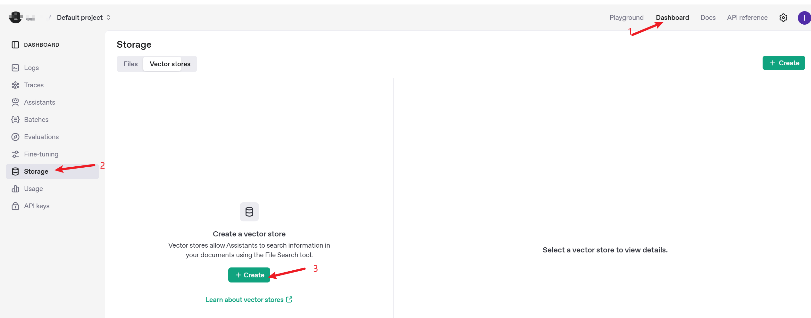
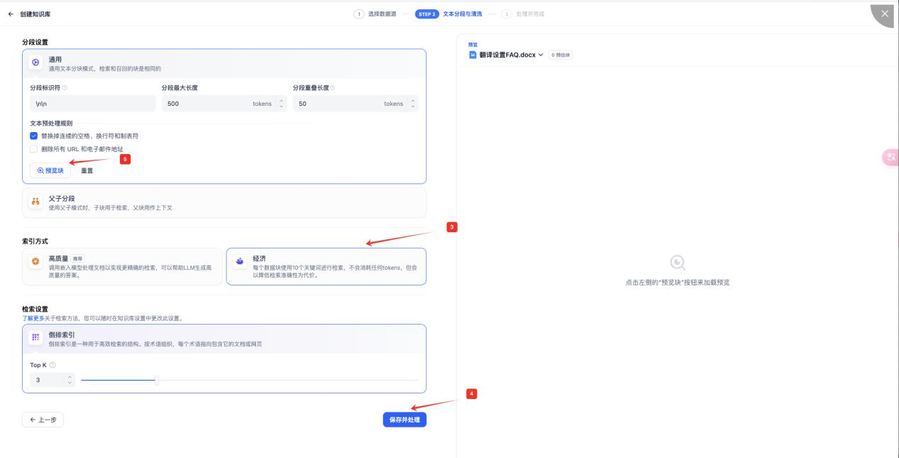
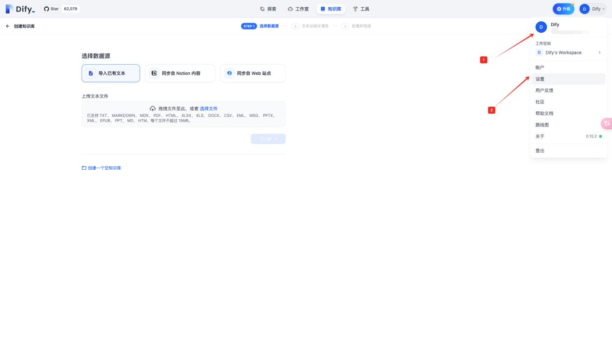
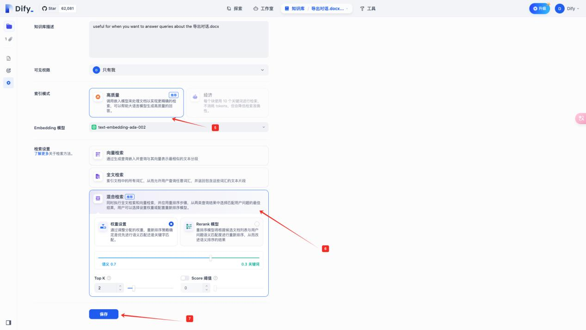
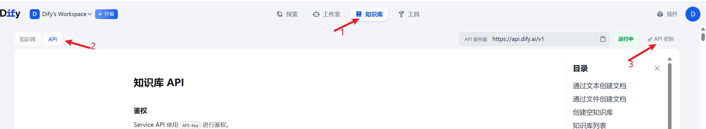

# AI客服

## 功能介绍

通过接入Dify和OpenAI平台的API，桌面端会话聊天直接应用AI客服，能够显著提高客服回复效率，降低人力成本。当客服不能及时响应时，也能够自动回复客户，实现全天候服务。

✅辅助模式：辅助客服快速回复客户，从知识库中提取答案作为预览，客服可复制发送，提高工作效率

✅托管模式：适用于客服不在线时，从知识库里识别内容进行自动回复，实现全天候服务，提升客户体验

## 操作教程

### Open AI配置指引

**1.  访问OpenAI（chatGPT）官网并完成登录**

官网地址：https://platform.openai.com/storage/vector\_stores

**2. 创建向量存储并添加文件至向量存储**

* 创建向量存储
* 按需导入知识库内容
* 赋值向量存储ID至SCRM创建机器人

<figure><figcaption></figcaption></figure>

<figure><figcaption></figcaption></figure>

#### 注意事项

* API Key管理：确保你的OpenAI API Key安全，不要泄露给他人。
* 定期更新知识库：为了保持机器人的知识时效性，建议定期更新知识库内容。

### Dify配置指引

1. 登录官网&#x20;

* 访问 Dify 官网 https://cloud.dify.ai 并完成登录。

2. 创建机器人  点击“创建空白应用”按钮。

* 在应用类型中选择“聊天助手”。&#x20;
* 设置机器人的名字及描述。&#x20;
* 点击“创建”按钮完成机器人创建。

<figure><figcaption></figcaption></figure>

<figure><figcaption></figcaption></figure>

3. 创建知识库

3.1 免费版知识库


注意：免费版知识库的索引方式仅支持“经济模式”，且官方提供 200 次免费调用次数


* 点击顶部菜单中的“知识库”分页
* 点击“创建知识库”按钮
* 按需导入知识库内容
* 可点击“预览块”按钮看文化分段是否准确

<figure><figcaption></figcaption></figure>

<figure><figcaption></figcaption></figure>

3.2 收费版知识库

优势：使用自己的 OpenAl 模型，索引模式支持“高质量模式”，且可设置“混合索引”，
\
回复内容更加准确

* 点击右上角“个人信息”
* 选择“设置”
* 在“模型供应商”选择“OpenAl”
* 点击“设置”并输入您的 OpenAl API Key
* 创建知识库时即可使用该自定义模型

<figure><figcaption></figcaption></figure>

<figure><figcaption></figcaption></figure>

<figure><figcaption></figcaption></figure>

4. 为机器人配置知识库

* 选择需要配置的机器人
* 点击“添加”按钮
* &#x20;按需导入已创建的知识库
* 点击“发布”按钮完成配置


建议：为了保证机器人的准确性和性能，建议在发布前进行调试和预览。测试机器人的响应
\
情况，确保其符合预期。


<figure><figcaption></figcaption></figure>

<figure><figcaption></figcaption></figure>

5. 如果上述操作完成后，创建应用的 API 秘钥、知识库的 API 秘钥并复制到 SCRM 即可创
   \
   建机器人。

<figure><figcaption></figcaption></figure>

<figure><figcaption></figcaption></figure>

#### 注意事项&#xD;

* 免费版与收费版的区别：免费版适合初步体验和轻量级使用，但功能有限；收费版提供
  \
  更强大的功能和更高的调用次数，适合有更高需求的用户。
* API Key 管理：确保你的 OpenAI API Key 安全，不要泄露给他人。
* 定期更新知识库：为了保持机器人的知识时效性，建议定期更新知识库内容。
