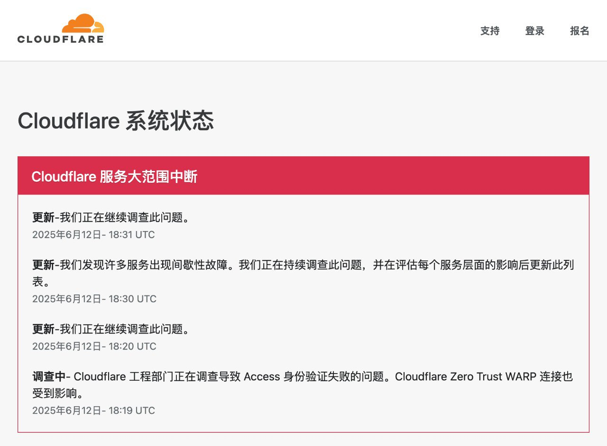

# 2025

2025.04.30/05.01/05.03/05.04 （遭受DDOS网络攻击）

尊敬的SCRM Champion系统客户：

您好！产品正在持续遭受DDOS攻击，导致当前服务出现临时性的中断问题，可能会导致部分用户在使用过程中出现异常。技术团队已第一时间介入处理和修复。

恢复后将同步更新。感谢您的理解与支持，我们将持续努力为您提供更稳定的服务。

尊敬SCRM Champion系统的用户：

您好！因DDOS网络攻击造成部分用户服务中断问题，经过技术团队紧急修复，产品服务已全面恢复，您可以正常登录并使用所有功能，数据安全无任何影响。

感谢您在故障期间的耐心等待与理解。如仍有异常，请随时联系客服反馈。

2025.04.30

🥳SCRM Champion系统【功能更新】通知

系统后台：
\
😊自动炒群优化升级：
\
▫️新增【自定义剧本】模式，设置话术场景和角色对话，提升社群活跃度
\
▫️支持添加备用角色，炒群主账号异常时可自动替换，确保炒群任务持续进行

\#自动炒群 #语音翻译

2025.04.25（#群分流 #AI翻译 #一键进群 #系统语言 #AI客服）

SCRM Champion系统【功能更新】通知

桌面端：
\
😊系统语言升级：
\
▫️新增日语
\
😊新增一键进群：
\
▫️支持WA/TG账号批量加群


\
桌面端&系统后台：
\
😊AI翻译线路升级：
\
▫️GPT/DeepSeek翻译线路新增【阿塞拜疆】语
\
😊AI客服升级：
\
▫️Dify平台完成图片调式后，对应的AI客服支持图片回复
\
系统后台：
\
😊后台UI优化：
\
▫️【激活码管理】、【账号管理】、【线索管理】UI优化，提升客户体验
\
😊群分流链接升级：
\
▫️设置群组的每日新增线索目标、总线索目标和线索重置时间，便于管理线索目标，并灵活调整策略

2025.04.23（AI客服-托管模式）

<figure><figcaption>
AI客服：托管模式
</figcaption></figure>

【AI客服】现已支持托管模式，即刻开启全新体验！

通过接入Dify和OpenAI平台的API，桌面端会话聊天直接应用AI客服，能够显著提高客服回复效率，降低人力成本。当客服不能及时响应时，也能够自动回复客户，实现全天候服务。

✅辅助模式：辅助客服快速回复客户，从知识库中提取答案作为预览，客服可复制发送，提高工作效率
\
✅托管模式：适用于客服不在线时，从知识库里识别内容进行自动回复，实现全天候服务，提升客户体验

2025.04.18（客户转派：封号继承、员工离职交接）

<figure><figcaption>
封号继承
</figcaption></figure>

【SCRM Champion】客户转派上线！

账号被封导致数据丢失？员工离职数据交接不便？客户转派解决您的烦恼，客户资料、标签、跟进记录、聊天消息无损备份，数据安全无忧！
\
可用于封号继承、账号更换、员工离职等业务场景
\
支持单个或批量转移账号数据，适用于 TG、WA、LINE 平台

2025.04.18

SCRM Champion系统【功能更新】通知

主管端优化升级
\
去重线索池：
\
▫️【导入线索】新增Messenger平台
\
▫️【一键删除】更改为【快速删除】，支持用户删除指定平台和数量的线索
\
账号列表：
\
▫️激活码备注在账号列表悬浮显示，方便查询账号归属
\
运营管理：
\
▫️文本类型的公共素材自动上传至AI客服的知识库中，提高AI客服的话术配置效率和响应准确率
\
账号列表和工单明细：
\
▫️LINE和Zalo平台【主号链接】支持手动复制官方链接进行编辑，以便更准确地进行分流和分配

2025.04.11

SCRM Champion系统【功能更新】通知

桌面端优化升级
\
基本设置：
\
▫️新增清除全部缓存功能，减少设备空间占用，提升用户体验
\
【AI客服】：
\
▫️新增托管模式，适用客服离线时从知识库里识别内容进行自动回复

2025.04.09 （SCRM Champion 与EchoData联动）

<figure><figcaption>
SCRM Champion EchoData
</figcaption></figure>

SCRM Champion\&EchoData数据联动！

SCRM Champion上传数据时支持将粉丝数据入库至EchoData。
\
SCRM Champion数据同步007TG生态数据中心后，可通过 EchoData 进行多维度数据分析，获取自身及生态内其他用户对该数据的营销情况。
\
后续将支持粉丝数据的营销效果分析，敬请期待！

2025.04.03

SCRM Champion系统【功能更新】通知

群组列表升级：
\
▫️支持手动编辑TG、WA进群链接，方便用户加入群组
\
▫️新增【会话存档】列，支持手动开启/关闭群组会话存档，提高用户自主性

2025.03.28

SCRM Champion系统【功能更新】通知

桌面端：
\
聚合翻译升级：
\
▫️DeepSeek线路支持反向翻译，可用于提高翻译质量
\
【群发消息】优化：
\
▫️【消息间隔时间/对话间隔时间】支持手动输入数值，方便群发操作

主管端：
\
后台菜单整合及UI优化：
\
▫️优化页面设计，页面布局更合理，交互更快捷，体验更流畅
\
【会话存档】升级：
\
▫️新增WA平台外部群存档，助力员工合规管理及客户关系维护
\
【账号列表】升级：
\
▫️支持查看账号上下线时间详情，有效统计员工的使用情况，优化资源管理

2025.03.25

SCRM Champion系统【功能更新】通知

桌面端优化升级：
\
【会话列表】升级：
\
▫️新增【刷新会话】按钮，优化交互流畅度并提升刷新响应效率
\
【快捷回复】优化：
\
▫️固定【直接发送/先翻译再发送】按钮，提升消息发送效率与便利性

主管端优化升级：
\
【AI客服管理】升级：
\
▫️支持配置OpenAI平台，满足用户更多平台需求
\
【在线聊天】升级：
\
▫️WABA聊天支持图片/视频接收和发送，提升沟通效率与营销灵活性
\
【社群管理】升级：
\
▫️新增【一键进群】，支持WA/TG批量加群，助力营销引流、社群运营
\
【会话统计】升级：
\
▫️新增切换查看维度按钮，支持按员工账号及绑定社交账号查看详情，更全面分析员工工作表现

2025.03.14（更新升级通知）

尊敬的SCRM Champion系统客户：

您好！我们将于吉隆坡时间2025年3⽉17⽇ 09:30 AM 至 11:00 AM 进行系统重大组件升级，提升用户体验，以下功能将无法使用：

系统后台：分享页面、客户列表、会话存档、激活码创建、线索标签、社交账号列表、工作合规、线索活跃度、导入线索去重，设备信息。
\
桌面端：修改备注、跟进记录。

感谢您的理解与支持。如您发现任何异常，请及时联系客服反馈，我们将竭力为您服务！

2025.03.17

尊敬的SCRM Champion系统客户：

您好！感谢您对SCRM Champion的信任与支持。经过技术团队的快速升级，系统已经恢复正常使用，数据安全无影响。

如您发现其他任何异常，请及时联我们客服团队，我们将竭力为您服务！

2025.03.14

SCRMChampion系统【功能更新】通知

【会话存档】升级：
\
▫️TG平台新增外部群数据支持，可查看外部群聊天消息和监控外部群

2025.03.07

SCRMChampion系统【功能更新】通知

【敏感行为】升级：
\
▫️支持查看WhatsApp平台删除视频消息的记录
\
【WA计数】升级：
\
▫️优化 WA 线索的统计方式，使线索统计更加高效和及时
\
【会话存档】升级：
\
▫️WhatsApp平台支持视频接收与发送，满足用户多样化的使用需求
\
【重粉标记】升级：
\
▫️ 标记范围新增【去重线索池】，客服对接客户属于线索池线索时显示标记

2025.03.05（更新升级通知）

尊敬的SCRM Champion系统客户：

您好！我们将于吉隆坡时间2025年3⽉6⽇ 09:30 AM 至 10:00 AM 进行系统重大组件升级，提升用户体验，以下功能将无法使用：

系统后台：分享页面、客户列表、会话存档、激活码创建、线索标签、社交账号列表、工作合规、线索活跃度等，导入线索去重，设备信息。 桌面端：修改备注、跟进记录。

感谢您的理解与支持。如您发现任何异常，请及时联系客服反馈，我们将竭力为您服务！

2025.03.06

尊敬的SCRM Champion系统客户：

您好！感谢您对SCRM Champion的信任与支持。经过技术团队的快速升级，系统已经恢复正常使用，数据安全无影响。

如您发现其他任何异常，请及时联我们客服团队，我们将竭力为您服务！

2025.03.04（故障与修复）

📣Emergency maintenance announcement:

The SCRMChampion system is currently under emergency maintenance. We deeply apologize and thank you for your understanding and patience. Please pay close attention to our follow-up notifications to ensure you get the latest service status updates.

📣紧急维护公告：

当前SCRMChampion系统紧急维护中，我们深感歉意，并感谢您的理解与耐心。请密切关注我们的后续通知，确保您获取最新的服务状态更新。

尊敬的SCRM Champion系统客户：

您好！感谢您对SCRM Champion的信任与支持。经过技术团队的全力修复，系统已经恢复正常，数据安全无影响。

如您发现其他任何异常，请及时联我们客服团队。再次感谢您的理解与支持！

2025.02.28（WhatsApp Business API 聊天室）

😎【SCRM Champion】在线聊天室上线！

快速集成 WhatsApp Business API，让企业轻松统一管理与客户的 WA 消息；接入后可统一接收和回复客户信息，高效管理WA通信，全面提升客户服务质量。

😊提高运营效率：通过自动化消息处理和客户服务功能，减少人工成本，提高运营效率，降低企业成本&#x20;

😊增强企业信任度：凭借高安全性的 WhatsApp Business API 和官方认证的企业绿标，提升客户对企业的信任感&#x20;

😊个性化服务：通过实时沟通与个性化服务，打造更优质的用户体验，增强客户满意度，同时助力提升品牌形象&#x20;

即将接入Telegram、LINE平台API，敬请期待！&#x20;

2025.02.28

SCRMChampion系统【功能更新】通知

😊【会话统计】优化： ▫️支持查看敏感词与敏感行为详情，分析管理更精准。&#x20;

😊【系统后台&登录页UI优化】： ▫️界面全新升级，颜值与体验双提升，操作更舒适流畅！&#x20;

😊【线索管理】优化： ▫️去重线索池新增【一键删除】功能，清理导入数据更便捷。&#x20;

😊【跟进记录】优化： ▫️移除24小时删除限制，记录管理更灵活，满足多样化需求！&#x20;

😊【会话列表】升级： ▫️桌面端新增顶部集中分布，快速定位会话，多账号操作更高效！&#x20;

😊【会话存档】升级： ▫️可导出近28天聊天记录，数据更全面，助力月度总结和话术优化！

2025.02.28（LINE Business官方故障）

尊敬的SCRM Champion系统客户：

您好！由于LINE Business官方故障原因，导致账号登录出现【发生暂时性错误】，请等待官方处理。

恢复后我们将第一时间通知您，感谢您的理解与支持。如有其他问题需要进一步协助，请随时联系我们的客服团队，我们将竭力为您服务！

尊敬的SCRM Champion系统客户：

您好！LINE Business官方故障已修复，受影响的LINE Business平台已经恢复正常使用！

如您发现其他任何异常，请及时联我们客服团队。感谢您的理解与支持！

2025.02.24

SCRMChampion系统【功能更新】通知

😊【内控管理】升级： ▫️新增【消息类型管控】功能，支持限制员工社交账号发送和接收：图片、链接、语音、视频和附件消息。

😊【TG超级置顶】优化： ▫️支持文件夹对话置顶，方便用户搜索和管理重要对话

😊【会话存档】升级： ▫️LINE平台支持查看和发送【视频】类型消息 ▫️Telegram平台支持查看和发送【附件】类型消息

😊计数功能升级： ▫️新增指定工单去重，可选择当前工单与所需去重的工单进行对比

2025.02.24（维护与修复）

尊敬SCRM Champion系统的用户：

您好！我们监测到当前产品后台服务出现访问异常，技术团队已在第一时间排查修复。

我们预计将在30分钟内完全恢复服务（具体时间视修复进度可能提前）。期间您可能暂时无法登录后台或使用部分功能，数据安全不会受到影响。

对此我们深表歉意，感谢您的理解与支持。如有紧急需求，请联系客服，谢谢

尊敬SCRM Champion系统的用户：

您好！经过技术团队紧急修复，产品后台服务已全面恢复，您可以正常登录并使用所有功能，数据安全无影响。

感谢您在故障期间的耐心等待与理解。如仍有异常，请随时联系客服反馈。

2025.02.13（考勤管理）

.png>)

**【SCRM Champion】考勤管理上线！**

根据企业需求设置考勤规则，支持固定班制、排班制、自由班制等多种工作模式，自动统计员工打卡数据，员工可在桌面端用子账号登录并进行考勤打卡，轻松管理考勤！

1️⃣考勤报表：自动统计员工考勤数据&#x20;

2️⃣考勤组管理：设置出勤人员、出勤时间&#x20;

3️⃣排班管理：按需为员工安排工作班次，支持按天排班、周期排班&#x20;

4️⃣班次管理：灵活安排员工班次，设置明确的上下班时间及打卡规则

2025.02.10

1️&#x20E3;**【AI智能客服】优化**：

&#x20;新增配置指引，优化功能体验，提升使用便捷性与整体体验

2025.01.24

1️&#x20E3;**【会话统计】升级**：

&#x20;新增群发任务数据统计，方便查看群发任务数据和调整群发策略&#x20;

**2️⃣新增【翻译管理】**：

&#x20;可在后台配置自己的OpenAI翻译模型，支持员工在桌面端选择使用&#x20;

**3️⃣【会话存档】升级**：&#x20;

新增聊天记录模糊搜索，支持连续四字及以上关键词检索，便于主管快速查询所需信息

2025.01.17

1️⃣【语音翻译】升级：

新增有道线路，支持葡萄牙语（巴西）语音转文字

2025.01.14

1️⃣新增AI翻译线路—DeepSeek：&#x20;

文本翻译更准确，同时语言理解能力更强

2️⃣新增识别web3地址信息：&#x20;

检测地址：波场、以太坊

自动检测桌面端私聊/群聊消息的钱包地址，识别并提醒危险钱包地址，保障用户财产安全

2025.01.10（AI智能客服）

.png>)

**【AI智能客服管理】上线！SCRM Champion开启全新体验！**

支持接入第三方API（Dify平台），可用于桌面端会话聊天使用，支持辅助模式，提高客服效率和降低人工回复成本！

✅辅助模式：辅助客服提供回复话术场景，从知识库里抽取该消息答案为预览状态，客服可快速发送&#x20;

✅一键使用：支持桌面端直接选用机器人&#x20;

✅数据列表：所有机器人一目了然，快速管理机器人状态

2025.01.10

1️⃣LINE平台调整：

▫️限制桌面端表情包弹窗宽度，提高用户阅读和操作的舒适性 ▫️会话存档支持查看图片类型的聊天消息，方便更全面查看员工聊天记录&#x20;

2️⃣【Webhook】设置升级：&#x20;

▫️增加配置平台以及简化配置流程，方便没有开发基础的用户直接使用平台提醒&#x20;

3️⃣【敏感行为监控】升级：&#x20;

▫️新增LINE平台【删除消息】【删除对话】的敏感行为监控，支持查询管理员工敏感行为问题&#x20;

4️⃣新增外部群统计：&#x20;

▫️群组列表更新统计规则，具有管理权限的群组统计为内部群，仅为群成员的群组为外部群，内外部群均会记录在群组列表

2025.01.02（群计数）

.png>)

**SCRM Champion【新成员统计】上线！**

自动追踪并统计指定时间段内的新进群成员、净增成员以及重复客户数量等关键指标&#x20;

✔️ 可作为社群有效统计实际粉丝量的工具&#x20;

✔️适用于群成员去重及流量结算的依据&#x20;

✔️通过分流链接将数据分享给业务双方，让双方查看实时数据

2025.01.02

1️⃣【会话存档】升级：&#x20;

▫️Telegram平台会话存档新增贴纸消息&#x20;

2️⃣【线索列表】升级：&#x20;

▫️支持按工单号模糊搜索，方便快速查找相似工单&#x20;

3️⃣【LINE WORKS】支持计数：&#x20;

▫️可用于工单去重，流量计数，重粉查询等业务场景&#x20;

4️⃣【账号列表】优化：&#x20;

▫️支持分享工单后接收方编辑【备注2】，方便员工编辑业务内容&#x20;

▫️账号列表新增自定义设置，可按照个人需求设置账号列表显示列&#x20;

5️⃣【关键词自动回复】升级：&#x20;

▫️新增关键词触发频率及触发详情表单，支持关键词单独或全局设置固定时间内仅触发一次

