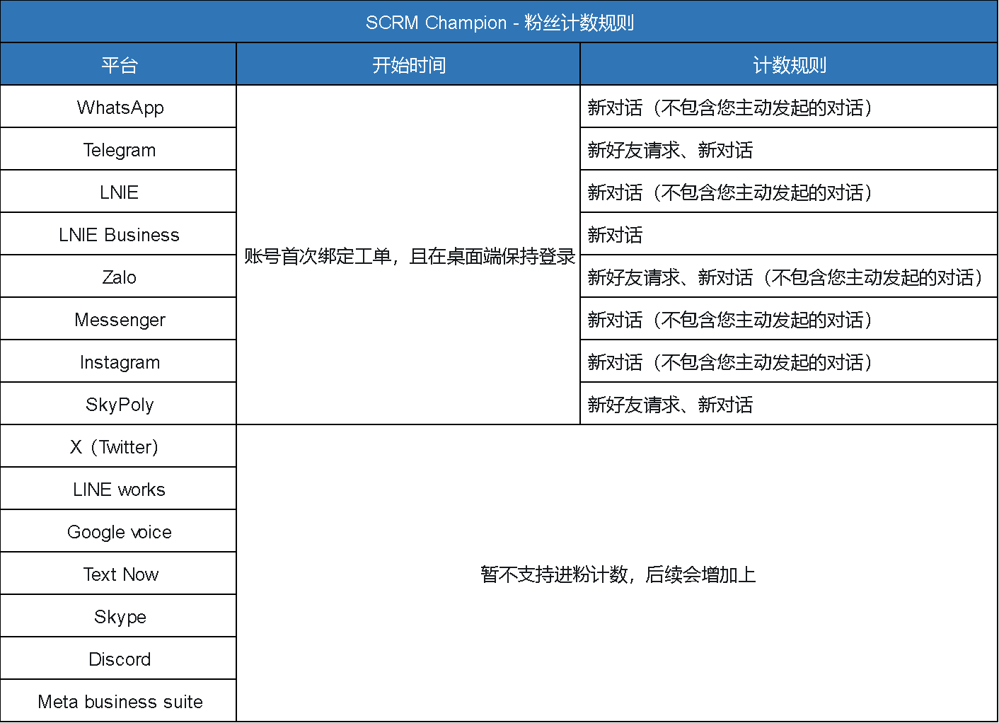

# ❓ 常见问题

进粉的匹配规则是怎么样的？

<mark style="color:green;">问题回复</mark>：优先选取＂当日已完成目标数最少的＂的主号，如果都一样，再选取“已完成总目标数最少的”，如果还是一样，那就随机分配主号

进粉时账号下线，那剩余末计算粉丝还会统计吗？

<mark style="color:green;">问题回复</mark>：会，如进粉时账号下线，再次上线可查看补录粉丝数量，建议进粉时保持在线状态。

计数器的计数规则

翻译时候发送出去的结果不是我想要的怎么办？

<mark style="color:green;">问题回复</mark>：为了预防这种情况，我们系统内可以在打开【发送消息实时翻译】的情况下，先在输入框内输入您需要发送的文字，按住Ctrl+T，此时输入框内的文字就进行自动翻译。您可以自行查看该翻译结果，或者转到【聚合翻译】内，输入您刚才翻译的译文重译一遍，可以提前知道译文的真实含义。如果您不小心已经发送了不合时宜的译文，可以选择撤回。

翻译的时候经常出现等待很久翻译中？

<mark style="color:green;">问题回复</mark>：如果同一路线很多人一起使用，确实会造成拥挤的情况，这边建议尝试切换不同的路线，如果还不能解决，我们会和相关开发人员沟通如何对此进行优化。

如果登录账号时，提示已经登录其他工单该怎么处理？

<mark style="color:green;">问题回复</mark>：\
当您的账号在【组织架构】中有设置时，会提示”仅限于当前部门下的激活码登录，禁止跨激活码使用，如需调整，请联系主管“\
<mark style="color:yellow;">解决方案</mark>：主管端→组织管理→组织架构→点击部门分组右手边的三个点，选择编辑部门→按需更改部门激活码。（原因：因为该账号所在部门绑定了激活码，如果在不是该部门下的激活码登录打开，就不登录打开，且有此提示）

当您的账号未设置【组织架构】时，会提示”当前账号已在XXXXXX工单登录“\
<mark style="color:yellow;">解决方案</mark>：复制工单号后，在SCRM Champion后台找到对应的工单，对已登录的工单的主号点击 【移除工单】 即可；\
\
<mark style="color:red;">特殊情况</mark>：如果是自己的号不小心登在别人工单下，这种情况建您先找到该工单的号主，自行协商沟通要求移除工单。

如果上述操作未能解决您的问题，请联系官方客服。

工单打不开跟我这边网络有没有关系？

<mark style="color:green;">问题回复</mark>：工单访问确实受IP限制影响，若分享对象网络不符合要求（中国IP、俄罗斯IP）则无法打开。同时不排除本地网络波动或系统维护因素（但概率较低，维护也会提前通知）。

💡 为了更快定位问题，您可以将工单号及页面截图同步至专属对接群，您的客户成功经理会第一时间协助排查哦\~

软件什么时候更新？对我会造成什么影响？

<mark style="color:green;">问题回复</mark>：本软件在SCRM Champion公共频道（[https://t.me/SCRMchampion](https://t.me/SCRMchampion)）上发布更新信息，您可以关注公共频道获取最新的版本信息和维护信息。

一般更新是不会对您的业务造成影响的。如发现有更新提示，桌面端只需要重新启动即可实现自动更新。

在以下情况下，您的使用体验可能会受到短暂影响：

1. 产品维护：我们会提前通过频道或产品后台通知您，以便您提前做好准备。
2. 平台波动：如果发生平台波动，我们将第一时间反馈受影响的范围，并提供使用建议。波动恢复后，我们会及时发布公告，确保您了解最新状态。

如果上述操作未能解决您的问题，请联系官方客服。

一台电脑可以登录多少桌面端？

<mark style="color:green;">问题回复</mark>：能多开五个桌面端，可以分别做不同的营销打粉接粉任务。

一个桌面端最多可以登录多少个账号？一般多开多少个账号还能流畅运行？

<mark style="color:green;">问题回复</mark>：这取决于您所拥有的最大端口数，一个端口对应一个账号。能开多少账号具体看您的电脑配置，以及看您多开的平台。像有的客户最多可以多开到1000+账号，有的客户可能就只开4-5个账号。主要是看您每个账号的对话数据有多少，您账号数据越少，能多开的账号越多；电脑运行内存越高，能开的账号也越多；所以这边账号多开可以根据您的业务需求进行合理配置。

代理IP用什么协议好？

<mark style="color:green;">问题回复</mark>：推荐使用SOCKS5协议，好用安全，具体介绍可以参考 [dai-li-she-zhi.md](zhuo-mian-duan-fq/dai-li-she-zhi.md "mention")

